# 🛡️ DriftSentinel: ML Observability & Drift Detection Platform


**DriftSentinel** is a production-grade MLOps monitoring system designed to detect "silent model failure" in financial transaction pipelines. 

Unlike traditional monitoring that waits for system crashes, this platform uses statistical hypothesis testing (**Kolmogorov-Smirnov Test**) to identify when live production data diverges from training baselines—preventing financial loss before it happens. It features an integrated **GenAI Agent (NVIDIA Nemotron)** to translate statistical alerts into actionable business insights.

---

## 🏗️ System Architecture

The system simulates a real-time production environment where data flows in batches. It decouples the **Statistical Engine** from the **Intelligence Layer**.

```mermaid
graph TD
    A[Raw Transaction Stream] -->|Batch Ingestion| B(Drift Detection Engine)
    B -->|Compare vs Baseline| C{Statistical Tests}
    C -->|Z-Score| D[Mean Shift Check]
    C -->|KS-Test| E[Distribution Shape Check]
    D & E --> F[Drift Severity Scoring]
    F -->|Threshold > 0.1| G[🔴 RED ALERT]
    G --> H[LLM Explainer Agent]
    H -->|NVIDIA Nemotron| I[Root Cause Report]

```



## 🚀 Key Features
### 1. 🧠 Statistical Drift Engine
- Beyond Averages: Doesn't just check if the mean changed. Uses the Kolmogorov-Smirnov (KS) Test to detect shape changes in data distributions (e.g., variance shifts, bimodal splits).

- Z-Score Analysis: Instant detection of catastrophic mean shifts.

- Reference Profiling: Locks a "Golden State" baseline from training data to prevent drift creep.

### 2. ⚡ Real-Time Data Simulation
- Custom Stream Generator: Simulates a live Kafka-style feed using the PaySim financial dataset.

- Drift Injection Module: Capable of artificially injecting specific failures (e.g., Inflation Shock, Schema Breakage) to test system resilience.

### 3. 🤖 GenAI Root Cause Analysis
- Integrated NVIDIA Nemotron-70B (via OpenRouter) as a semantic layer.

- Translates raw metrics (e.g., "KS-Stat: 0.19 on Feature 'Amount'") into executive summaries.

- Streaming Response: Real-time token streaming for immediate feedback.

### 4. 📊 Operational Dashboard
- Built with Streamlit & Plotly.

- Visualizes drift magnitude over time.

- Provides immediate "Go/No-Go" health status for ML pipelines.

## 🛠️ Tech Stack

| Component | Technology | Role |
| :--- | :--- | :--- |
| **Language** | Python 3.x | Core Logic |
| **Frontend** | Streamlit | Real-time Dashboard |
| **Math Engine** | SciPy, NumPy | Statistical Hypothesis Testing |
| **Visualization** | Plotly | Interactive Drift Charts |
| **GenAI** | NVIDIA Nemotron | Automated Root Cause Explanation |
| **Data** | PaySim (Simulated) | Mobile Money Transaction Logs |

## ⚙️ Installation & Setup
### 1. Clone the Repository
```Bash
git clone [https://github.com/yourusername/drift-sentinel.git](https://github.com/yourusername/drift-sentinel.git)
cd drift-sentinel
```
### 2. Set Up Environment
Create a virtual environment to keep dependencies clean.

``` Bash
python -m venv venv
# Windows
venv\Scripts\activate
# Mac/Linux
source venv/bin/activate
```
### 3. Install Dependencies
```Bash
pip install -r requirements.txt
```
### 4. Configure API Keys
Create a .env file in the root directory.

```Bash
touch .env
Add your OpenRouter API key (Required for the AI Explainer):

Ini, TOML
OPENROUTER_API_KEY=sk-or-v1-xxxxxxxxxxxxxxxxxxxx
```

## ▶️ How to Run
Start the Dashboard:

```Bash
streamlit run src/app.py
```
### The Simulation Flow:

- Phase 1 (Normal): Click Process Next Batch a few times. The system compares live data to the baseline. Status should be 🟢 HEALTHY.

- Phase 2 (Attack): Check the box 💉 Inject Drift. This simulates a market event (e.g., hyper-inflation affecting transaction amounts).

- Phase 3 (Detection): Click Process Next Batch. The KS-Statistic will spike. Status turns 🔴 DRIFT DETECTED.

- Phase 4 (Explanation): Click 🤖 Generate AI Analysis. The LLM will analyze the vector shift and explain the business risk.

## 📂 Project Structure
```
drift-sentinel/
├── data/                   # Raw PaySim transaction logs
├── src/
│   ├── app.py              # Streamlit Dashboard Entry Point
│   ├── drift_engine.py     # Statistical Logic (KS-Test, Z-Score)
│   ├── data_simulator.py   # Simulates live data stream & injection
│   └── llm_explainer.py    # GenAI Integration (OpenRouter)
├── .env                    # API Keys (GitIgnored)
├── requirements.txt        # Python Dependencies
└── README.md               # Documentation
```
## 💡 Business Value (Why this matters)
In production, model accuracy is not static.

- If a fraud model is trained on 2023 data, it will fail on 2024 patterns due to inflation and behavior changes.

- Traditional monitoring only catches failures after money is lost.

- DriftSentinel catches the distributional shift in the data before the model makes incorrect predictions, acting as an early warning system for MLOps teams.

## 👤 Author

Siddharth Jaiswal

📍 Varanasi, India

🔗 LinkedIn: [https://www.linkedin.com/in/siddharth-jaiswal-ba7047228/](url)
